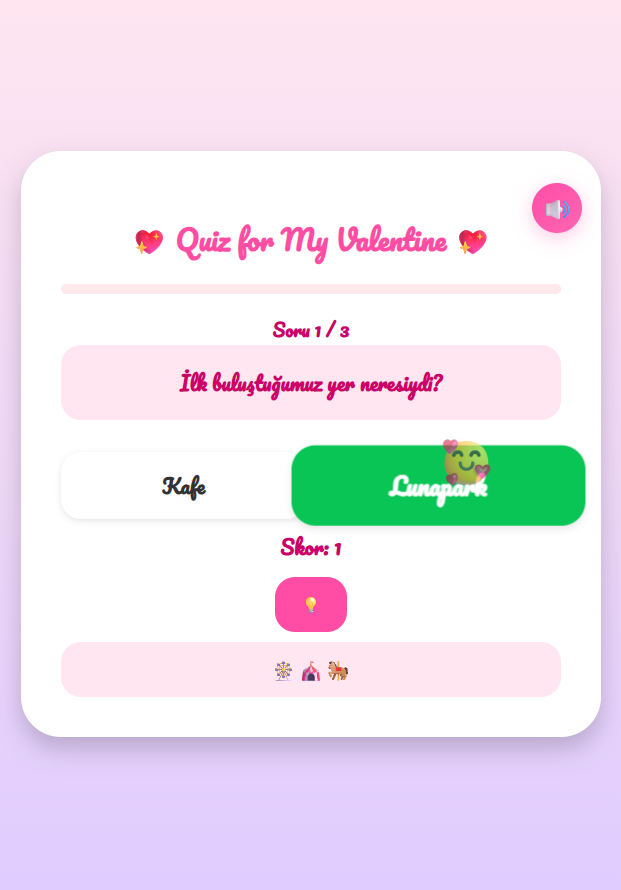
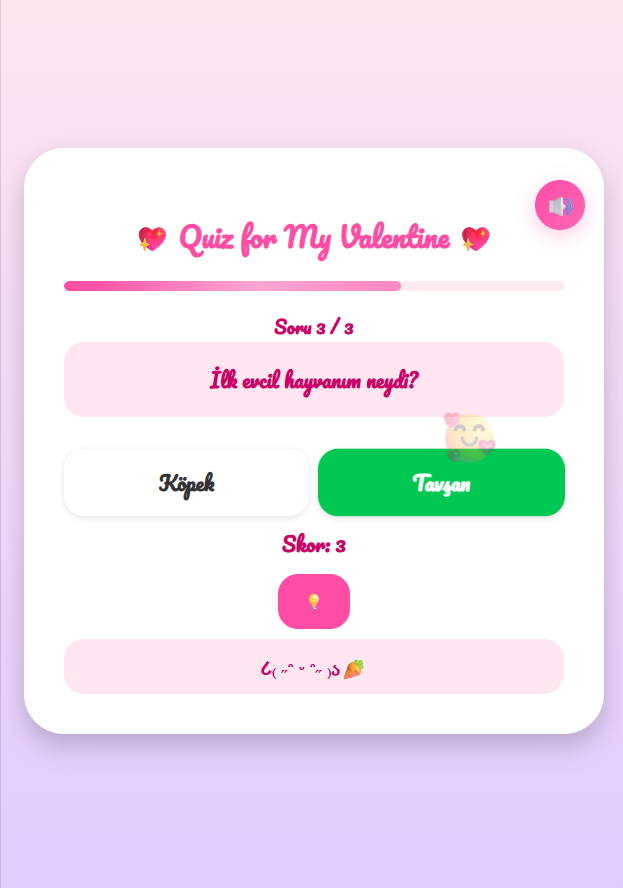
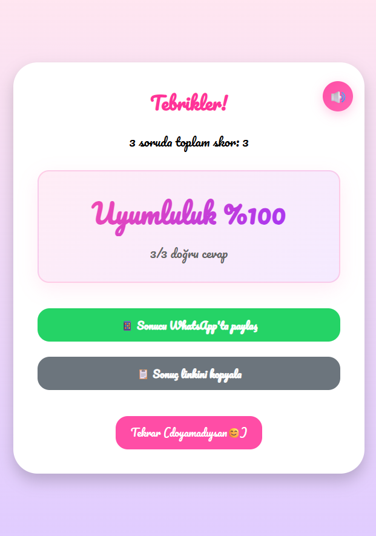
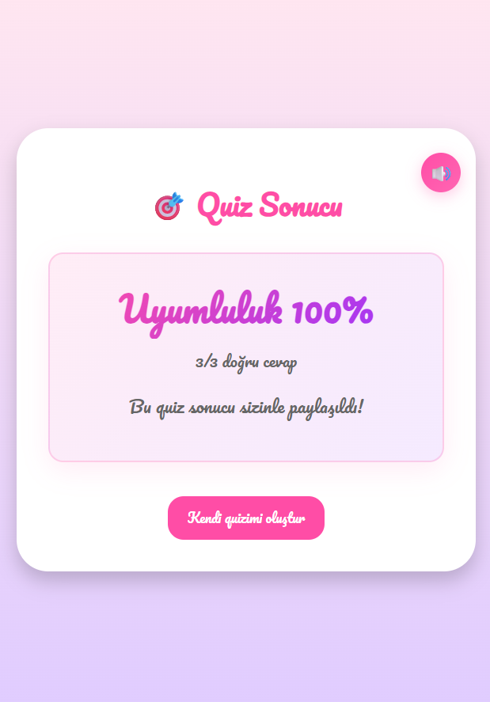

# Quiz-for-My-Valentine-TR
Çiftler için tatlı ve romantik bir web tabanlı bilgi yarışması oyunu.

🔗 **İlk testini oluştur!:** https://semihalp.github.io/Quiz-for-My-Valentine-TR/

## Özellikler
- Havalı bir spinner ile 1-25 arası soru oluşturma
- WhatsApp/URL ile paylaşım
- Animasyonlu soru kartları
- Çift uyumluluk analizi
- Emojiler ve ses efektleri

## Teknolojiler
- Vanilla JavaScript
- HTML5 / CSS3
- Web Audio API
- GitHub Pages

## Nasıl Oynanır?
-  Açılış ekranında bulunan döndürücü ile 1-25 arası soru seçiniz.
-  Seçtiğiniz soru sayısı kadar soru oluşturmaya başlayınız.
-  Sorularınıza seçeneklerinizi giriniz ve doğru seçeneğinizi belirleyiniz.
-  Partnerinize yardımcı olmak için sorularınıza ipucu giriniz. ☻
-  Hazır olduğunuzda testi WhatsApp veya URL yoluyla partnerinizle paylaşabilirsiniz!
-  Partneriniz her doğru cevap için +1 puan kazanır. Yanlış cevap da ise bir kayıp yaşamaz.
-  Test bittiğinde partneriniz karşısına gelen "Uyumluluk Analizi" kartı ile skorunu ve sizinle olan uyumunu öğrenebilir, dilerse bu sonucu sizinle WhatsApp veya URL aracılığıyla paylaşabilir!
-  Partneriniz "Tekrar Oyna" butonu ile yeniden testi çözmeye başlayabilir.
-  Sizinle paylaşılan uyumluluk sonucu kartı ile skoru görebilir, dilerseniz de karttaki buton ile tekrardan bir test oluşturabilirsiniz.
-  Oyun boyunca ekranın sağ üstünde bulunan ses açma/kapama butonu ile sesi kontrol edebilirsiniz.
-  Tüm bunlara ek olarak oyun boyunca devam eden tatlı ve romantik animasyonlarla eğlenceniz katlanır!
-  İYİ EĞLENCELER! ♥

## Oyundan Kareler
<table>
  <tr>
    <td></td>
    <td></td>
  </tr>
  <tr>
    <td></td>
    <td></td>
  </tr>
  <tr>
    <td></td>
    <td></td>
  </tr>
  <tr>
    <td></td>
    <td></td>
  </tr>
  <tr>
</table>

# • Logo •

Logo tasarımı "Bullet for My Valentine" adlı metal grubundan esinlenilmiştir.

## Neden GitHub Pages?
- Ücretsiz: GitHub Pages tamamen ücretsiz
- Hızlı: Direkt tarayıcıda çalışıyor, sunucu gecikmesi yok
- Güvenli: Hiçbir kişisel veri saklanmıyor
- Kolay: Tek HTML dosyası, deploy kolay
- SSL: Otomatik HTTPS sertifikası
- Güvenilir: GitHub'ın altyapısı
