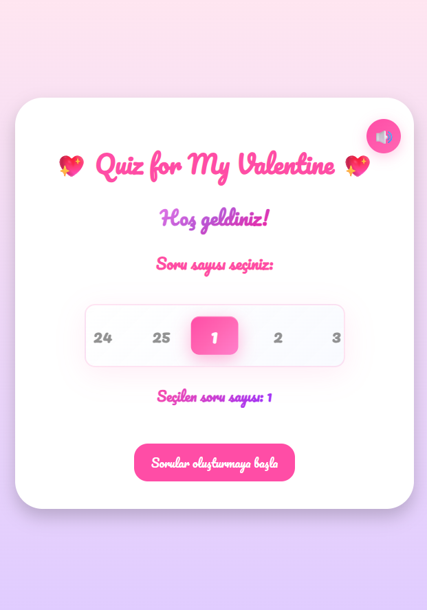
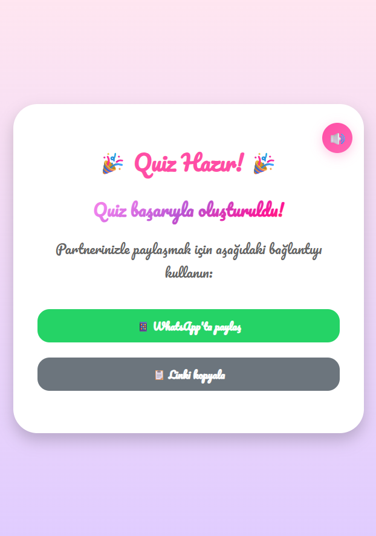
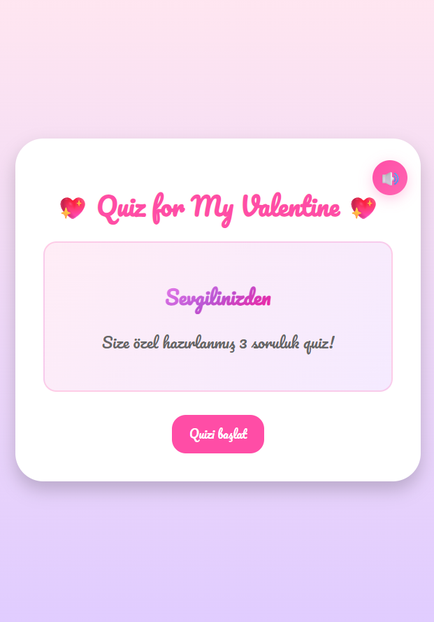
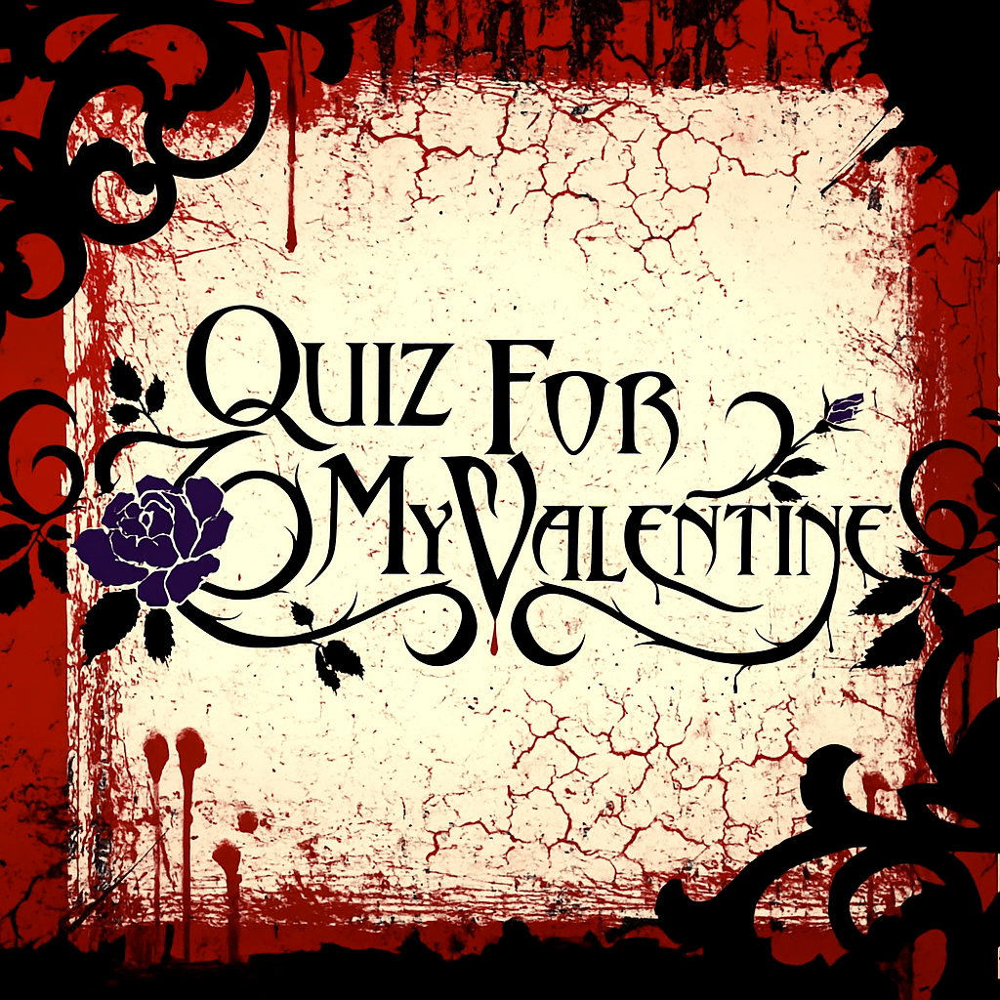

# Quiz-for-My-Valentine-TR
Çiftler için tatlı ve romantik bir web tabanlı bilgi yarışması oyunu.

🔗 **İlk testini oluştur!:** https://semihalp.github.io/Quiz-for-My-Valentine-TR/

## Özellikler
- Havalı bir spinner ile 1-25 arası soru oluşturma
- WhatsApp/URL ile paylaşım
- Animasyonlu soru kartları
- Çift uyumluluk analizi
- Emojiler ve ses efektleri

## Teknolojiler
- Vanilla JavaScript
- HTML5 / CSS3
- Web Audio API
- GitHub Pages

<table>
  <tr>
    <td></td>
    <td></td>
  </tr>
  <tr>
    <td></td>
    <td></td>
  </tr>
</table>

# • Logo •

Logo tasarımı "Bullet for My Valentine" adlı metal grubundan esinlenilmiştir.
